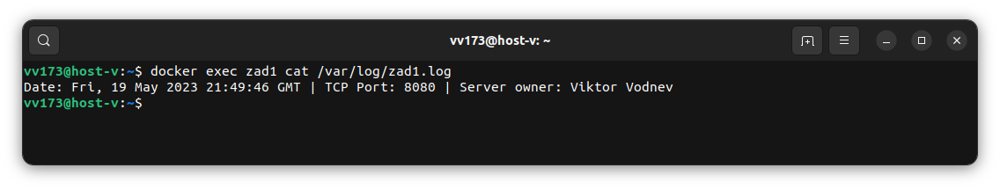
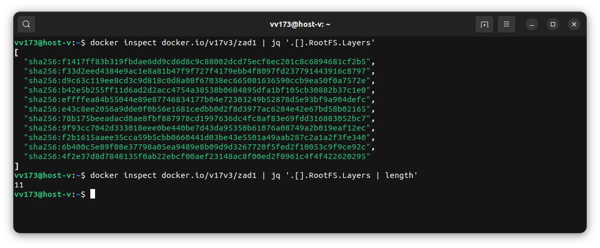
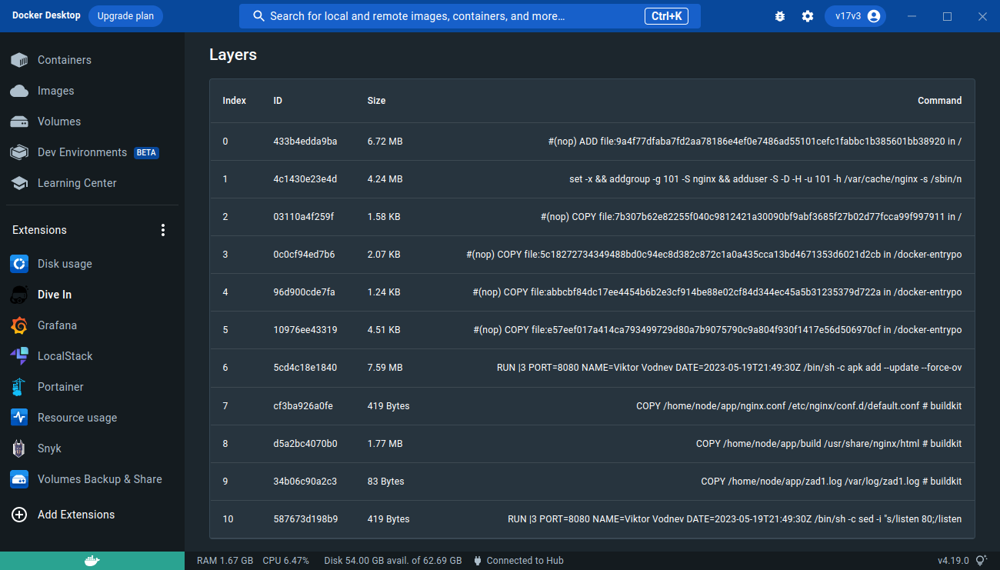
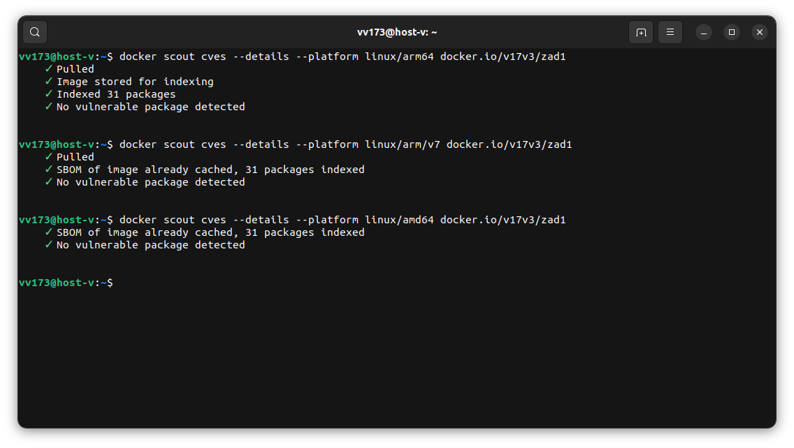
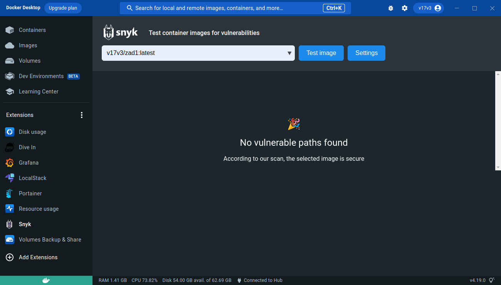

# Sprawozdanie z zadania 1

## CZĘŚĆ OBOWIĄZKOWA
<br/><br/>
### a. Zbudowanie kontenera
Budowanie odbywa się za pomocą silnika buildkit. Przed budowaniem należy uruchomić kontener buildkit oraz dodać zmienną środowiskową zawierającą scieżkę do kontenera buildkit.   
```
docker run -d --name buildkitd --restart always --privileged moby/buildkit:latest
export BUILDKIT_HOST=docker-container://buildkitd
```
Oprócz tego kontener wymaga agenta ssh, więc przed budowaniem należy upewnić się, że jest uruchomiony.
```
eval $(ssh-agent)
```
Poza tym należy pamiętać, że agent ssh powinien zawierać w sobie klucz do github. Sprawdzić czy klucz został dodany, można używając polecenia:
```
ssh-add -L
```
Pod czas budowanie cache obrazu jest osobno exportowany do docker hub. Obraz kontenera jest przekazywany do dwóch registry, pierwsze w dockerhub, drugie w azure.
<br/><br/>
Budowanie kontenera przy użyciu buildctl.
```
buildctl build \
    --frontend=dockerfile.v0 \
    --local context=. \
    --local dockerfile=. \
    --ssh default=$SSH_AUTH_SOCK \
    --output type=image,\"name=zad1registry.azurecr.io/zad1,docker.io/v17v3/zad1\",push=true \
    --export-cache type=registry,mode=max,ref=docker.io/v17v3/zad1-cache \
    --import-cache type=registry,ref=docker.io/v17v3/zad1-cache \
    --opt build-arg:USER_ID=7777 \
    --opt build-arg:NAME='Viktor Vodnev' \
    --opt build-arg:PORT=8080 \
    --opt build-arg:DATE=$(date -u +"%Y-%m-%dT%H:%M:%SZ") \
    --opt platform=linux/arm/v7,linux/arm64/v8,linux/amd64
```
<br/><br/>
Budowanie kontenera przy użyciu docker buildx.
```
docker buildx build \
    --ssh default=$SSH_AUTH_SOCK \
    --cache-from type=registry,ref=docker.io/v17v3/zad1-cache \
    --cache-to type=registry,ref=docker.io/v17v3/zad1-cache \
    --output=type=registry \
    --platform=linux/arm/v7,linux/arm64/v8,linux/amd64 \
    --build-arg USER_ID=7777 \
    --build-arg NAME='Viktor Vodnev' \
    --build-arg PORT=8080 \
    --build-arg DATE=$(date -u +"%Y-%m-%dT%H:%M:%SZ") \
    --progress=tty \
    --tag docker.io/v17v3/zad1 \
    --tag zad1registry.azurecr.io/zad1 .
```
### b. Uruchomienie kontenera.
```
docker run --name zad1 -dt -p 8080:8080 docker.io/v17v3/zad1
```
### c. Uzyskanie logów wygenerowanych przez aplikacje.
Plik wygenerowany przez aplikacje znajduje się w katalogie /var/log o nazwie zad1.log.
```
docker exec zad1 cat /var/log/zad1.log
```

### d. Warstwy kontenera.
Podejrzeć zbudowane warstwa oraz ich hash możemy używ polecenia **docker inspect**
```
docker inspect docker.io/v17v3/zad1 | jq '.[].RootFS.Layers'
```


Aby policzyć warstwy kontenera należy dodać opcje 'length' do polecenia **jq**
```
docker inspect docker.io/v17v3/zad1 | jq '.[].RootFS.Layers | length'
```
Dodatkowo utworzone warstwy kontenera możemy sprawdzić w aplikacji Dive.



## Skanowanie obrazu kontenera za pomocą narzędzia Docker Scount.



Dodatkowo raporty w formacie plików tekstowych json zostali umieszczone w folderze scout_reports.

## Skanowanie obrazu kontenera za pomocą narzędzia Snyk.
